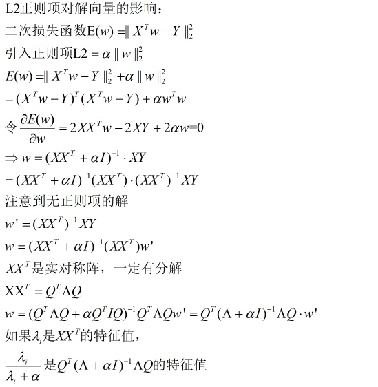
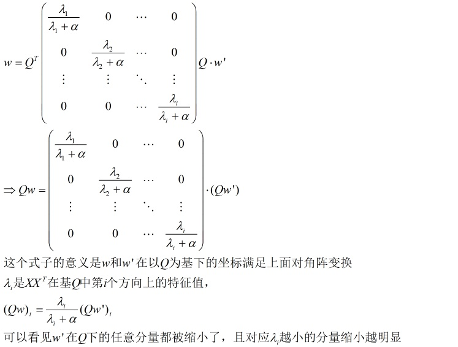
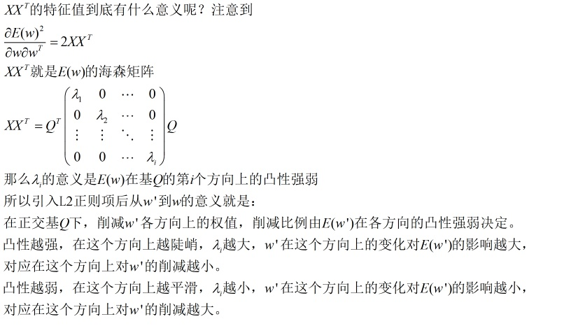

1. L2正则化可以让解更小(靠近0)，但比较平滑(不等于0), 考虑L2正则化式子  
   $$E(w)=||X^Tw-Y||_2^2+\alpha||w||_2^2$$
   令$\frac{\partial E(w)}{\partial w}=0$, 可以解出$w=(XX^T+\alpha I)^{-1}XY$,而原先不加正则项时解为$w'=(XX^T)^{-1}XY$,因此可以得到w和w'的关系：  
   $w=(XX^T+\alpha I)^{-1}(XX^T)w'$  
   如果因为$XX^T$是实对称阵，所以有$XX^T=Q^T\wedge Q$，可以推导出  
   $$
   w=Q^T
   \left(
   \begin{matrix}
   \frac{\lambda_1}{\lambda_1+\alpha}      & 0      & \cdots & 0      \\
   0      & \frac{\lambda_2}{\lambda_2+\alpha}       & \cdots & 0      \\
   \vdots & \vdots & \ddots & \vdots \\
   0      & 0      & \cdots & \frac{\lambda_i}{\lambda_i+\alpha}       \\
   \end{matrix}
   \right)
   Qw'
   $$
   也就是说
   $$
   Qw=
   \left(
   \begin{matrix}
   \frac{\lambda_1}{\lambda_1+\alpha}      & 0      & \cdots & 0      \\
   0      & \frac{\lambda_2}{\lambda_2+\alpha}       & \cdots & 0      \\
   \vdots & \vdots & \ddots & \vdots \\
   0      & 0      & \cdots & \frac{\lambda_i}{\lambda_i+\alpha}       \\
   \end{matrix}
   \right)
   Qw'
   $$  
   这个式子含义是w和w'在以Q为基下的坐标满足上面的对角阵变换。$\lambda_i$是$XX^T$在基Q中第i个方向上的特征值。可以看到w'在Q下的任意分量都被缩小了，且对应$\lambda_i$越小的分量缩小越明显。  
     
     
   