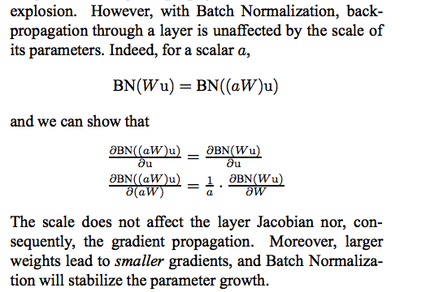

batch_norm主要解决的问题：  
1. 深度神经网络中，一般来说一层的输入经过某一层变换后，输出的分布和输入的分布会不一致。输出分布依赖于网络参数，而网络参数是在不断变化当中，且可能很小的改变就会导致输出的分布变动很大。因此下一层需要适应不断变化的分布，导致收敛减慢。
2. 随着训练进行，未经激活函数的网络输出X的某些维度很可能会变得很大。此时比如我们要是选了sigmoid作为激活函数，则sigmoid 的导数 $g'(x)$ 就会趋向于0。也就是进入了梯度饱和区。之前的解决方法是：选择relu，小心初始化参数并选择小的学习率。  

针对上面两个问题，在线性变化层之后，激活层之前加入batch norm层。对输入的每一维度都进行normalization的处理：
$$\hat{x}^{(k)}=\frac{x^{(k)}-E[x^{(k)}]}{\sqrt{Var[x^{(k)}]}}$$  
k表示x的一个维度。这样在激活前，数据就变成了均值为0，方差为1的分布。解决了分布偏移的问题。同时很显然这样处理后可以避免某些维度上x的值太大导致进入梯度饱和区。  

但是这样处理，会丧失网络所学习出的一些信息(如果按这样搞，那岂不是强制relu的输出有一半是0一半是非0？这明显不合理)，因此对该输出增加一次转换
$$y_i^{(k)} \leftarrow \gamma^{(k)}{\hat{x}_i^{(k)}+\beta^{(k)}}$$  
进行scale和shift，其中i表示这是某个batch中第i个样本。这里，$\gamma$和$\beta$ 是需要学习的参数。如果正好训练出来$\gamma^{(k)}=\sqrt(Var[x^{(k)}])$，$\beta^{(k)}=E[x^{(k)}]$，那么就恢复了原始的输入。

-----

Q: batch norm层为什么一般放在线性变换之后？而不是对一层的输入做变换？
A: 是可以，但是因

-----
batch norm可以起到一定防止训练过拟合的作用，因为过拟合实际上是训练数据中的noise导致，而在batch norm中，一个训练样本和其他样本发生了联系，减少了异常点的产生, 这就提高了网络的泛化性。

-----
batch norm可以有更高的学习率:
传统深度学习问题: 太高的学习率会导致梯度爆炸或者梯度消失，太低又容易陷入局部最优。
batch norm: 通过normalize，可以阻止参数细小的变化导致后续网络将这个变化扩大(比如引起蝴蝶效应)，比如它可以阻止网络陷入梯度饱和区。

同时batch norm也降低了参数初始化的要求，因为batch norm对参数的大小是不敏感的。不用batch norm时，一般来说大的学习率会增加参数的大小，从而在梯度反向传播时导致模型爆炸。但是用了BN后，反向传播时，梯度对参数大小就不太敏感了。
