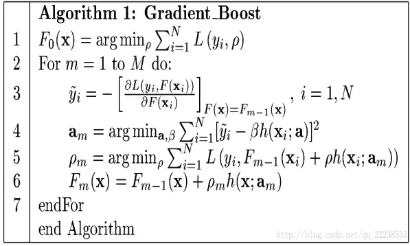
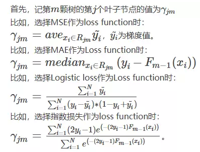
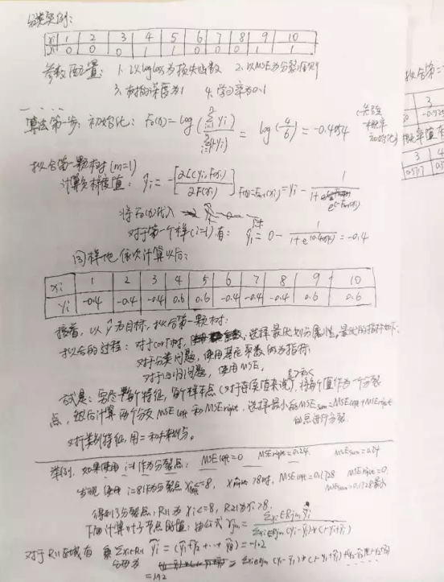
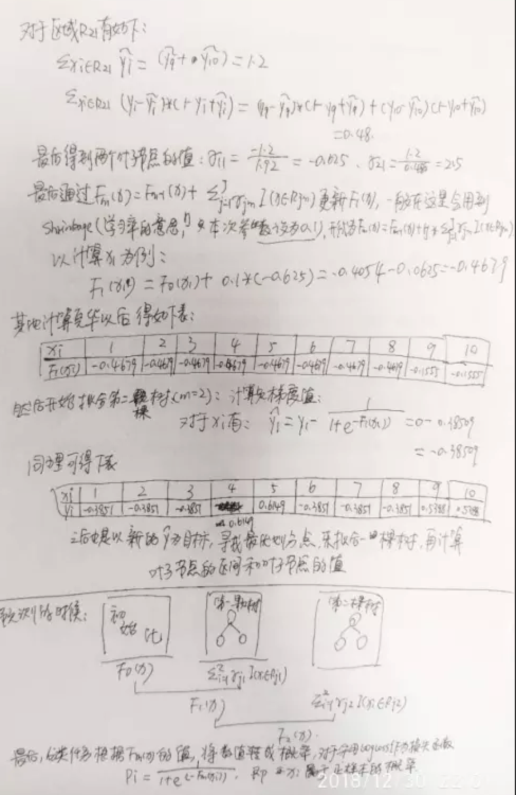
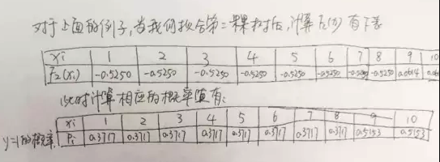
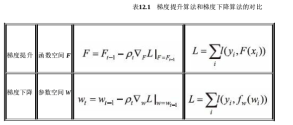

1. GDBT使用CART作为基分类器，因为是梯度提升，所以GDBT里面都是回归树。同时，回归树的分裂准则不再局限用MSE，也可以用MAE或其他(注意GDBT的损失函数和回归树的分裂方式没有关联，不要被网上的例子带偏，因为网上大都是用MSE来说明问题。)  
2. 具体使用GDBT的步骤:  
   一些解释：  
   (1) 第一步是初始化第一个弱分类器。
   (2) 迭代m轮，每一次先求负梯度的值，之后生成CART回归树去拟合负梯度。但是要区分一点的是，生成回归树时叶子节点的值不一定是叶子节点的输出值，比如生成回归树时叶子节点的值是落在该叶子节点上样本的均值，但实际该叶子节点输出值是要根据损失函数的具体形式计算的，在Friedman的论文中有这部分的推导(较为简略)，几个不同loss function的叶子节点输出值如下计算：
   (3) $\rho_m$是学习率，需要线性搜索最佳的学习率参数。  
3. 一个分类的实例：(1) 以logloss为损失函数。(2) 以MSE为分裂准则。(3) 树深度为1。(4) 学习率为0.1。  
4. 梯度提升算法和梯度下降算法的对比：(1) 相同点：两者都是在每一轮迭代中，利用损失函数相对于模型的负梯度方向的信息对当前模型进行更新。(2) 不同点：在梯度下降中，模型是以参数化的形式表示，从而模型更新等价于参数的更新。而在梯度提升中，模型并不需要进行参数化表示，而是直接定义在函数空间中，从而大大扩展了可以使用的模型种类。  

-----

可以探讨的问题:  
1. 梯度提升树时加法模型，那么加法模型的原理是什么。  
2. 梯度提升树如何防止过拟合？

----
参考资料：  
https://www.jianshu.com/p/e1fe864ca364  
https://www.zhihu.com/question/42496064  
为什么xgboost/gbdt在调参时为什么树的深度很少就能达到很高的精度(关于bias和variance): https://www.zhihu.com/question/45487317