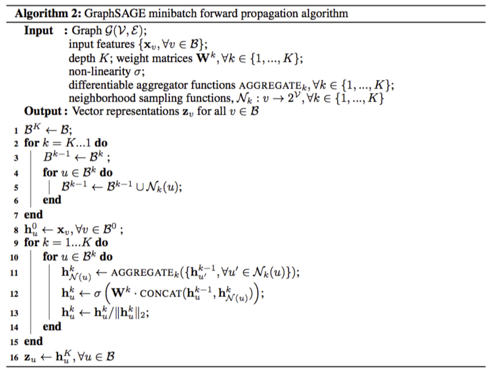
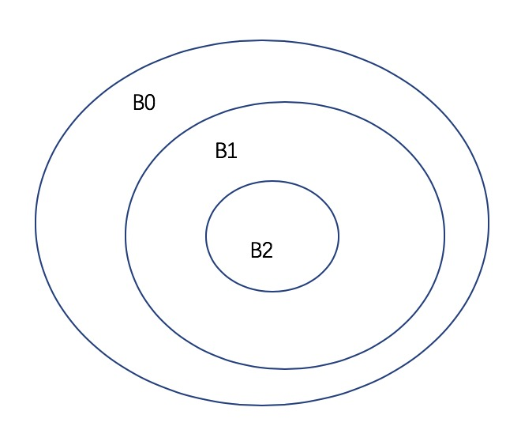

graphsage一些记录
---

graphsage在实际编程的时候，运用到的是minibatch式的算法，和全局graphsage还有所不同。假设深度为k，算法步骤：
1. 首先确立要计算的minibatch B(k), 
2. B(k-1) = B(k) + Neighbors(B(k)) ... ，B(0)确立了计算所需的最大节点范围。
3. 从B(0)开始计算并更新向量。
   
  
  
